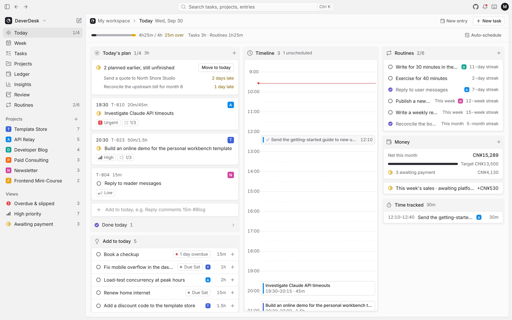
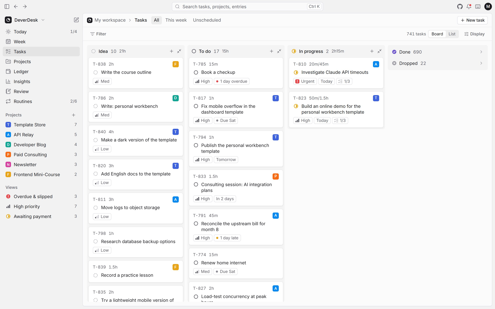
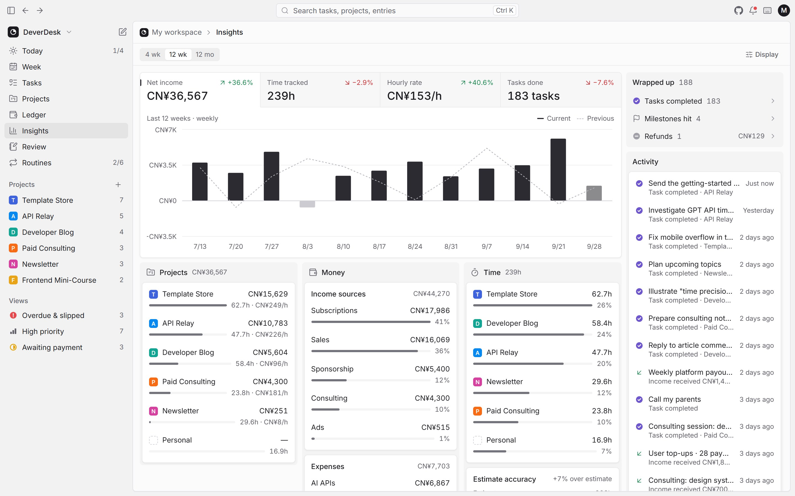
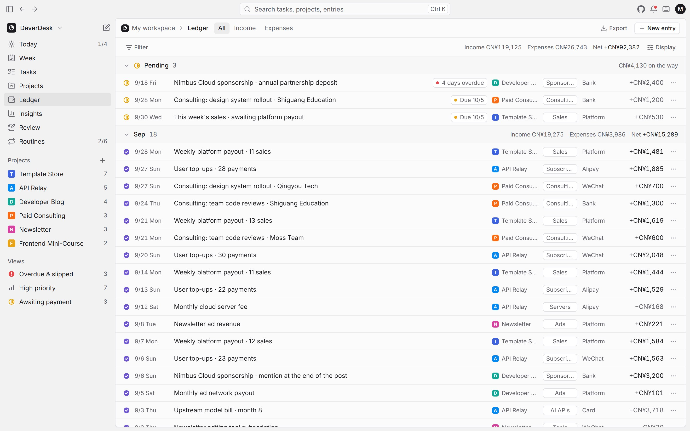

<div align="center">


# DeverDesk

**The one-person company console for indie developers.**

Tasks, time and side-project money in one place — and the real hourly rate of every project.

[](https://github.com/evepupil/DeverDesk/actions/workflows/ci.yml)
[](LICENSE)
[](https://app.deverdesk.com)
[](#deploy-your-own)

**English** · [简体中文](README.zh-CN.md)

</div>



## Why DeverDesk

Most indie developers run several things at once: a template store, an API relay, a blog, a consulting gig. Task apps know nothing about money, and bookkeeping apps know nothing about time — so it is hard to tell which project deserves your evenings.

DeverDesk keeps tasks, time and income together and connects them. Every task, time block and payment belongs to a project, so the app can show each project's net income, hours spent and resulting **hourly rate**.

- **Open source and self-hosted.** Run it on your own Cloudflare account. Your financial data never sits on someone else's server.
- **Free to run.** The Cloudflare free tier is more than enough for one person.
- **Fast to use.** Keyboard-first, with a command palette and one-line quick add, and it keeps working offline.

## Features

| View | What it does |
| --- | --- |
| **Today** | Today's plan; move unfinished work to today in one click; drag tasks onto a timeline, resize blocks to change duration, or auto-schedule the day; routines, net income this month vs. target, and time tracked today |
| **Week** | Seven days top to bottom with a capacity bar per day; drag tasks between days; unscheduled tasks on the side |
| **Tasks** | Board or list; group by status, project or priority; filter and sort; drag a card to another column to change it |
| **Projects** | A board by stage (idea, building, running); net income, hours, hourly rate, monthly goal progress and next milestone per project; a 12-week trend |
| **Ledger** | Pending payments pinned on top, everything else grouped by month, project or category; mark entries as received or refunded; CSV export |
| **Insights** | Net income, time tracked, hourly rate and tasks done on one trend chart, with breakdowns by project, money and time |
| **Review** | An auto-written weekly summary, what got done, where the time went, and three reflection notes |
| **Routines** | Daily, weekly and monthly routines with streaks and a check-in grid |

Everywhere: a command palette (<kbd>Ctrl</kbd>/<kbd>⌘</kbd> <kbd>K</kbd>), alerts for overbooked days, overdue tasks and late payments, a running timer, one-line quick add (`Write report 30m #blog tomorrow !!`), a quick-capture button on phones, backup export and import, and keyboard shortcuts (<kbd>?</kbd>).

The interface comes in **English and Chinese** — picked from your browser language and switchable from the avatar menu — and amounts are shown in the currency you choose.

<table>
  <tr>
    <td width="33%"></td>
    <td width="33%"></td>
    <td width="33%"></td>
  </tr>
  <tr>
    <td align="center">Tasks</td>
    <td align="center">Insights</td>
    <td align="center">Ledger</td>
  </tr>
</table>

## Two editions

|  | Local edition | Cloud edition |
| --- | --- | --- |
| Where your data lives | In this browser only | A D1 database in your own Cloudflare account |
| Sync across devices | — | Automatic, record by record; works offline |
| Sign-in | None | A passcode, or Cloudflare Access |
| How to get it | Open [app.deverdesk.com](https://app.deverdesk.com) | [Deploy your own](#deploy-your-own) |

Both editions are built from the same code; a build-time switch picks one. Moving from the local edition to the cloud edition is a backup export and import.

## Try it

Open **[app.deverdesk.com](https://app.deverdesk.com)**. It runs the local edition with sample data. Nothing is sent to a server, and everything you change stays in your browser.

## Deploy your own

The cloud edition is a static Next.js export plus a Cloudflare Worker (the API) and a D1 database, deployed together as a single Worker.

### One-click deploy

[](https://deploy.workers.cloudflare.com/?url=https://github.com/evepupil/DeverDesk)

1. Authorize GitHub. Cloudflare creates a copy of this repository in your account and redeploys whenever you push to it.
2. A D1 database is created for you.
3. Set `DEVERDESK_PASSWORD`: the passcode you type to open your workspace.
4. When the build finishes, open the `*.workers.dev` address and sign in.

To use your own domain, add it to the Worker in the Cloudflare dashboard (**Workers & Pages → your Worker → Settings → Domains & Routes**).

### Manual deploy

Requires Node.js 22+ and pnpm 10.

```bash
git clone https://github.com/evepupil/DeverDesk.git
cd DeverDesk
pnpm install
pnpm exec wrangler login                          # sign in to Cloudflare
pnpm build
pnpm run deploy                                   # create the tables, then deploy the Worker
pnpm exec wrangler secret put DEVERDESK_PASSWORD  # set your passcode (input is hidden)
```

`pnpm run deploy` applies database migrations before deploying. On a brand-new account it deploys once first so that Wrangler creates the database, then applies the migrations. Note the `run`: `pnpm deploy` on its own is an unrelated built-in pnpm command.

To update later, pull the latest code and run `pnpm build && pnpm run deploy` again.

### Sign-in options

- **Passcode** (default), set with `DEVERDESK_PASSWORD`. Sessions last 30 days. After 10 failed attempts from the same IP, sign-in is locked for 15 minutes. Changing the passcode signs out every device.
- **Cloudflare Access.** Put the Worker behind [Cloudflare Access](https://developers.cloudflare.com/cloudflare-one/policies/access/) and set `ACCESS_TEAM_DOMAIN` (for example `your-team.cloudflareaccess.com`) and `ACCESS_AUD` (the application's audience tag). People signed in through Access skip the passcode.

### Move data from the local edition

In the local edition, choose **Export backup** from the avatar menu. In your cloud edition, choose **Import backup** and pick that file.

## Connect an AI assistant (MCP)

The cloud edition is also an [MCP](https://modelcontextprotocol.io) server at `https://your-workspace.example.com/mcp`, so assistants such as Claude Code, Codex, Cursor and VS Code can log and plan for you.

1. Open the avatar menu → **Connect AI**, name the connection and pick what it may do:
   - **Read only**: it can only read your data.
   - **Propose** (default): its changes wait until you accept them in **AI activity**.
   - **Write**: changes apply right away and can be undone.
2. Copy the configuration shown for your client. The token is shown only once. For Claude Code it looks like this:

```bash
claude mcp add --transport http deverdesk https://your-workspace.example.com/mcp \
  --header "Authorization: Bearer dd_your_token"
```

What the assistant can do:

| Group | Tools |
| --- | --- |
| Capture | Add several tasks at once, record income and expenses (an external order ID skips duplicates), log time, start and stop the timer, check off routines, write weekly notes |
| Check | Today, this week, every project, one project in depth, stats for any period, the weekly review, keyword search, flexible queries |
| Plan | Edit tasks in bulk, schedule a day into free time slots, spread tasks over a week by capacity, reschedule, manage projects, milestones and routines, delete records |

Every change an assistant makes is recorded. The sparkles icon in the top bar opens **AI activity**, where you accept or reject proposals and undo changes; records created by an assistant carry the same icon. Deleting, or changing more than ten records at once, is shown to you as a preview first. Dates and times follow the time zone in your schedule settings, which the browser fills in the first time you sign in.

If the workspace sits behind Cloudflare Access, add an Access bypass rule for the `/mcp` path; DeverDesk checks the token itself. Claude on the web and in the mobile apps connects through OAuth, which isn't supported yet.

## Log coding time automatically

A small recorder listens to Claude Code (and Codex) while you work and turns what happened into finished tasks and time entries, in the side project you bound to the folder.

1. **Bind a folder to a project.** Open the project and add the folder name (for example `my-app`) under **Directory names**, or tell your assistant "add this project to DeverDesk".
2. **Create a token.** Avatar menu → **Connect AI**, create a token with the **Write** permission, and open the **Recorder** tab.
3. **Install the Claude Code plugin** and enter your workspace address (no trailing slash) and the token when asked:

```bash
claude plugin marketplace add evepupil/DeverDesk
claude plugin install deverdesk@deverdesk
```

For Codex, or without the plugin, download `integrations/claude-code/bin/deverdesk-recorder` from this repository and run `node deverdesk-recorder setup --url https://your-workspace.example.com --token dd_your_token --install-codex-hooks`. Run `deverdesk-recorder doctor` any time to check that everything is wired up.

How it counts:

- Time counts while you are around. A prompt starts the clock, 15 minutes without you stops it, and an AI working alone is counted for at most 15 minutes. Windows running in parallel share the time, so the total never exceeds the clock.
- A commit finishes a task: the work since the previous commit becomes a completed task named after the commit message. Tiny commits fold into the previous task. Write `Closes T-123` in the message to complete an existing task instead.
- Tasks show up about 15 minutes after the commit. The Today page shows what is running right now and a thin "actual" rail beside the timeline.
- Only folders bound to a project are uploaded. Everything else stays on your machine in `~/.deverdesk`.

## Automation API

The cloud edition also has a small HTTP API for scripts. Create a token from the avatar menu → **Connect AI** with the **Write** permission. Each token is shown only once and stored only as a hash.

| Endpoint | Purpose |
| --- | --- |
| `POST /api/tasks` | Create a task. Fields: `title` (required), `plannedFor` (`YYYY-MM-DD`), `estimateMin`, `priority` (0–4), `projectId`, `notes` |
| `POST /api/ledger` | Record income or an expense. Fields: `kind` (`income` / `expense`) and `amount` (required), `category`, `channel`, `projectId`, `status`, `date`, `expectedOn`, `note` |
| `GET /api/summary?month=YYYY-MM` | Income, expenses, net, minutes tracked and tasks done for one month |

```bash
curl -X POST https://your-workspace.example.com/api/tasks \
  -H "Authorization: Bearer dd_your_token" \
  -H "Content-Type: application/json" \
  -d '{"title":"Write the launch post","plannedFor":"2026-10-01","estimateMin":45}'
```

Records created through the API sync to every device like any other change, and show up in **AI activity**, where they can be undone.

## Development

Requirements: Node.js 22+ and pnpm 10. Development works on Windows, macOS and Linux.

```bash
pnpm install
pnpm dev          # cloud edition: pages on :3000, API on :8787, local passcode "dev"
pnpm dev:local    # local edition only, no API or database needed
```

The first `pnpm dev` creates `.dev.vars` from `.dev.vars.example` with the passcode `dev`, and applies the local database migrations. Use `PORT` and `API_PORT` to change the ports.

| Command | What it does |
| --- | --- |
| `pnpm build` / `pnpm build:local` | Build the cloud / local edition into `out/` |
| `pnpm typecheck` | Type-check the app and the Worker |
| `pnpm lint` | Run ESLint |
| `pnpm test` | Run the unit tests (Vitest) |
| `pnpm probe` | Click through the core flows of the built local edition in Microsoft Edge, in Chinese and English (run `pnpm build:local` first) |
| `pnpm e2e` | Start the API locally and simulate two devices signing in and syncing (run `pnpm build` first; it reads the passcode from `.dev.vars`) |
| `pnpm shots` / `pnpm shots:readme` | Take screenshots for visual checks / for this README |

Build-time variables:

| Variable | Purpose |
| --- | --- |
| `NEXT_PUBLIC_DEVERDESK_EDITION` | `local` builds the local edition; anything else builds the cloud edition |
| `NEXT_PUBLIC_DEVERDESK_REPO_URL` | The repository the local edition links to (point it at your fork) |
| `NEXT_PUBLIC_DEVERDESK_ANALYTICS_TOKEN` | Cloudflare Web Analytics token, used by the local edition only |

## Tech stack

- **App:** Next.js 16 (static export), React 19, TypeScript in strict mode, Tailwind CSS 4, shadcn/ui on Radix, Zustand, Recharts
- **Backend:** Cloudflare Workers with static assets, D1 (SQLite), Web Crypto
- **Quality:** Vitest, ESLint, and Playwright-driven acceptance scripts

## Project structure

```text
src/
  app/          routes
  features/     the app shell and one folder per view
  components/   UI primitives (shadcn/ui) and small building blocks
  domain/       pure logic: scheduling, routines, money, insights, quick-add parsing, search, backups
  state/        data store, preferences, sync status, and the storage layer (browser or cloud)
  i18n/         language settings and the English and Chinese dictionaries
  data/         catalogs and sample-data generation
  sync/         the sync protocol shared by the browser and the Worker
worker/         the Cloudflare Worker: sign-in, sync, tokens, the MCP server, the AI change log, automation API, D1 migrations
scripts/        dev server, build, deploy and acceptance scripts
deploy/demo/    configuration for the app.deverdesk.com demo
site/           the website (deverdesk.com): a separate Next.js project
docs/           design documents (in Chinese)
```

## Roadmap

- [x] Local and cloud editions from one codebase
- [x] Cloud backend: sign-in, record-level sync, offline support, one-click deploy
- [x] English and Chinese interface, currency setting
- [x] An MCP server so AI assistants can read, log and plan, with a change log you can review and undo
- [ ] Log coding time and tasks automatically while you work with an AI coding assistant
- [ ] OAuth sign-in for Claude on the web and mobile, and ChatGPT
- [ ] Automatic income import from payment platforms

Milestones and module designs (in Chinese) live in [docs/roadmap.md](docs/roadmap.md).

## Contributing

Issues and pull requests are welcome; see [CONTRIBUTING.md](CONTRIBUTING.md). All interface text lives in `src/i18n/messages`, so please add both English and Chinese when you add text.

## Security

Please report vulnerabilities privately; see [SECURITY.md](SECURITY.md).

## License

[GNU AGPL v3.0](LICENSE). You are free to use, modify and self-host DeverDesk. If you offer a modified version to others as a network service, you must also make its source code available to them.
