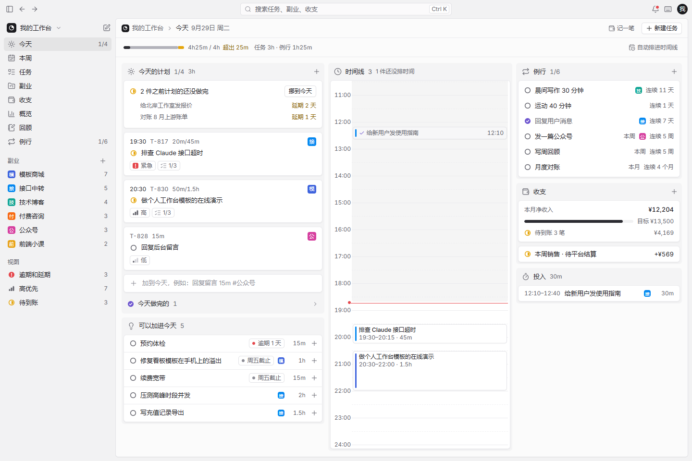

# DeverDesk

独立开发者的一人公司控制台：任务、时间和副业收支放在一起，算出每个副业每小时到底赚多少。



## 能做什么

| 页面 | 做什么 |
| --- | --- |
| 今天 | 今天的计划、之前没做完的一键挪到今天、可以加进今天的建议；时间线上拖动改时间、拖下边改时长、点空白处排任务、一键自动排；例行打卡、本月净收入对照目标、今天的投入记录 |
| 本周 | 七天从上往下排，每天一个容量条看出哪天排满；任务在日子之间拖动，右边是还没排日子的任务 |
| 任务 | 看板或列表；按状态、副业、优先级分组；筛选、排序；卡片拖到别的列就改成那一列的状态 / 副业 / 优先级 |
| 副业 | 按构思、搭建中、运营中排成看板；每个副业的本月净收入、投入、时薪、月目标进度、下个里程碑；详情里看 12 周走势 |
| 收支 | 待到账单独放最上面，其余按月（或副业、分类）分组；标记到账、退款；导出表格 |
| 概览 | 净收入、投入时间、时薪、完成任务四个指标切换同一张走势图；按副业、钱、时间拆开看 |
| 回顾 | 每周自动写一段小结；完成的事、每天投入、钱；三段复盘笔记 |
| 例行 | 每天、每周、每月的例行事务，连续期数和打卡格子 |

全局：Ctrl/⌘ K 搜任务、副业、收支；右上角提醒（排超了、逾期、钱过了约定日没到）；计时条；一行快速添加（`写周报 30m #技术博客 明天 !!`）；手机右下角快速记录；导出 / 导入备份；按 `?` 看快捷键。

## 本地版和在线版

| | 本地版 | 在线版 |
| --- | --- | --- |
| 数据存在哪 | 这台设备的浏览器里 | 你自己 Cloudflare 账号里的数据库 |
| 多设备同步 | 不同步 | 手机、电脑自动同步 |
| 怎么用 | 打开 [deverdesk.com](https://deverdesk.com) 直接用，或者自己部署 | 部署到自己的 Cloudflare，免费额度个人用不完 |

两个版本是同一套代码，打包时用环境变量切换，默认打包在线版。

## 运行

```bash
pnpm install
pnpm dev             # 开发在线版：页面 + 接口一起跑，访问口令见终端
pnpm dev:local       # 只开本地版页面，不需要接口和数据库
pnpm build           # 打包在线版，导出静态文件到 out/
pnpm build:local     # 打包本地版
pnpm deploy:demo     # 打包本地版并部署成演示站（需要先登录 wrangler，域名在同一个 Cloudflare 账号里）
pnpm test            # 跑单元测试（vitest，一个测试框架）
pnpm db:migrate:local  # 单独执行本地数据库迁移（migration，建表和改表结构的 SQL 脚本）
```

`pnpm dev` 默认页面在 3000、接口在 8787，用环境变量 `PORT`、`API_PORT` 改（PowerShell 里写 `$env:PORT=3100; pnpm dev`）。第一次 `pnpm dev` 会自动从 `.dev.vars.example` 复制出 `.dev.vars` 并把口令设为 `dev`，终端会提示「本地访问口令：dev」；`.dev.vars` 已被 git 忽略，改口令直接编辑它。

| 环境变量 | 作用 |
| --- | --- |
| `NEXT_PUBLIC_DEVERDESK_EDITION` | `local` 打包本地版，其余打包在线版 |
| `NEXT_PUBLIC_DEVERDESK_REPO_URL` | 本地版右上角 GitHub 图标指向的仓库，fork 后可以换成自己的 |
| `NEXT_PUBLIC_DEVERDESK_ANALYTICS_TOKEN` | Cloudflare 网页统计令牌，只在本地版生效 |

地址后面加 `?fail=save`，第一次保存会故意失败，用来看失败提示和重试。

## 在线版部署

在线版 = Next.js 静态页面 + Cloudflare Worker（接口）+ D1（数据库）。Worker 是 Cloudflare 的服务端程序，D1 是它家的 SQLite 数据库，免费额度个人用不完。

### 一键部署

点下面的按钮，把整个应用部署到你自己的 Cloudflare 账号（仓库需要保持公开）：

[](https://deploy.workers.cloudflare.com/?url=https://github.com/evepupil/DeverDesk)

点完之后会发生这些事：

1. 授权你的 GitHub 账号，Cloudflare 会在你的账号下复制一份仓库（以后在这个副本上推送代码，Cloudflare 会自动重新部署）。
2. 自动建好 D1 数据库。
3. 让你填访问口令（对应 `.dev.vars.example` 里的 `DEVERDESK_PASSWORD`，打开网站时要输入的口令）。
4. 部署完成后给你一个 `*.workers.dev` 的网址，打开输入口令就能用。

部署完成后想换自己的域名：在 Cloudflare 后台找到这个 Worker（在 Workers & Pages 里），在它的设置里加自定义域名即可。

想用 Cloudflare Access（Cloudflare 的登录网关，可以用公司账号统一登录）代替口令的，在 Worker 的设置里加两个变量：`ACCESS_TEAM_DOMAIN` 和 `ACCESS_AUD`，不填不影响口令登录。

### 手动部署

不方便用按钮的话，命令行也能部署：

```bash
pnpm install
pnpm exec wrangler login                          # 登录你的 Cloudflare 账号
pnpm build
pnpm run deploy                                   # 建表并部署（pnpm 自带一个 deploy 命令，这里要写 run）
pnpm exec wrangler secret put DEVERDESK_PASSWORD  # 设访问口令，输入时不显示
```

`pnpm run deploy` 先把数据库迁移应用到线上（建好表），再部署 Worker；新账号第一次部署还没有数据库时，会先部署一次让 wrangler 自动建好数据库，再建表。以后更新代码重复 `pnpm build` 和 `pnpm run deploy` 即可，口令只用设一次。

### 从本地版搬数据

已经在用本地版？在本地版右上角头像菜单里「导出备份」，再到在线版里「导入备份」就行。

## 核对

```bash
pnpm typecheck && pnpm lint && pnpm test   # 类型检查、代码检查、单元测试
```

下面两个脚本用本机 Edge 直接读 `out/` 里的文件，不启动服务，先打包本地版 `pnpm build:local`：

```bash
pnpm probe        # 真的点一遍：快速添加、拖动排期、自动排、标记到账、例行、快捷键、计时、本地版说明，核对数字和刷新后是否还在
pnpm shots        # 各页面、各宽度和交互状态截图，输出到 scripts/acceptance/.shots/
```

在线版的端到端核对会在本机起一个接口（用独立的临时数据库），两个浏览器窗口模拟两台设备，核对登录、互相同步、离线补传、同时修改、访问令牌和退出登录。先打包在线版，并且跑过一次 `pnpm dev` 生成本地口令：

```bash
pnpm build && pnpm e2e
```

## 目录

| 位置 | 放什么 |
| --- | --- |
| `src/styles/tokens.css` | 设计令牌：配色、字号、圆角、阴影、密度 |
| `src/domain/` | 只做计算、不碰界面：排期、例行、收支、指标、回顾、快速添加解析、搜索、备份校验 |
| `src/data/` | 状态叫法、分类选项、样例数据生成 |
| `src/state/` | 数据、界面偏好、浮层开合；`storage/` 是存储层（本地版写浏览器，在线版接云端） |
| `src/lib/edition.ts` | 版本开关：本地版还是在线版 |
| `src/sync/protocol.ts`、`src/lib/api.ts` | 前后端共用的同步约定；浏览器调用接口 |
| `worker/` | 在线版接口（Cloudflare Worker）：登录、同步、访问令牌、给 AI 助手用的操作接口；`migrations/` 是数据库建表语句 |
| `src/components/` | 基础组件：shadcn 组件和状态图形、标签、看板列等 |
| `src/features/` | 外框（`shell`）、各页面和共用部件 |
| `src/app/` | 路由 |
| `deploy/demo/` | 本地版演示站的部署配置 |
| `scripts/` | 本地开发、按版本打包、核对脚本 |

设计规格见 [docs/前端设计.md](docs/前端设计.md)，各模块怎么工作见 [docs/模块设计/](docs/模块设计/)。

## 许可证

[AGPL-3.0](LICENSE)。可以自由使用、修改和自己部署；改过的版本如果拿去对外提供在线服务，也需要公开源代码。
