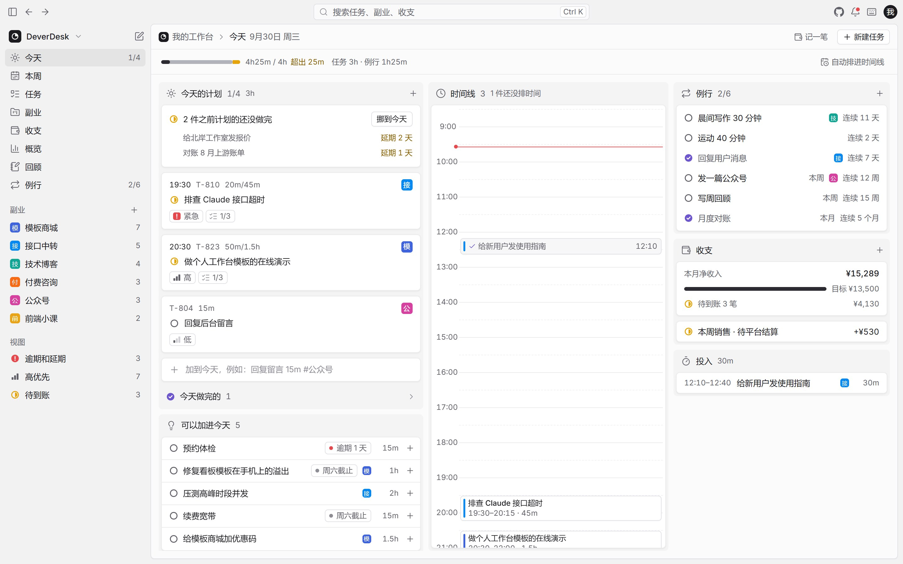
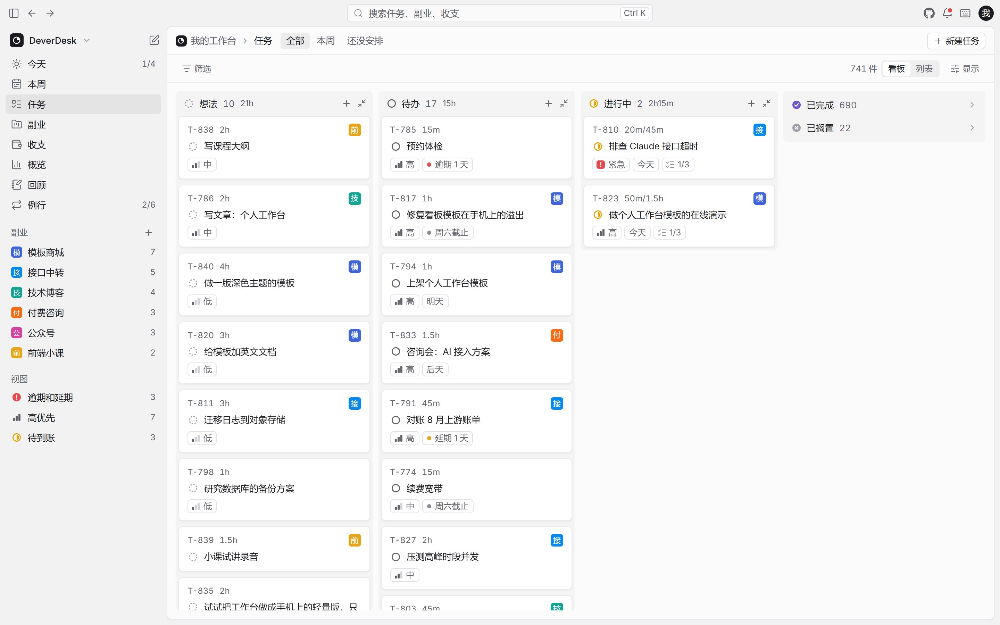
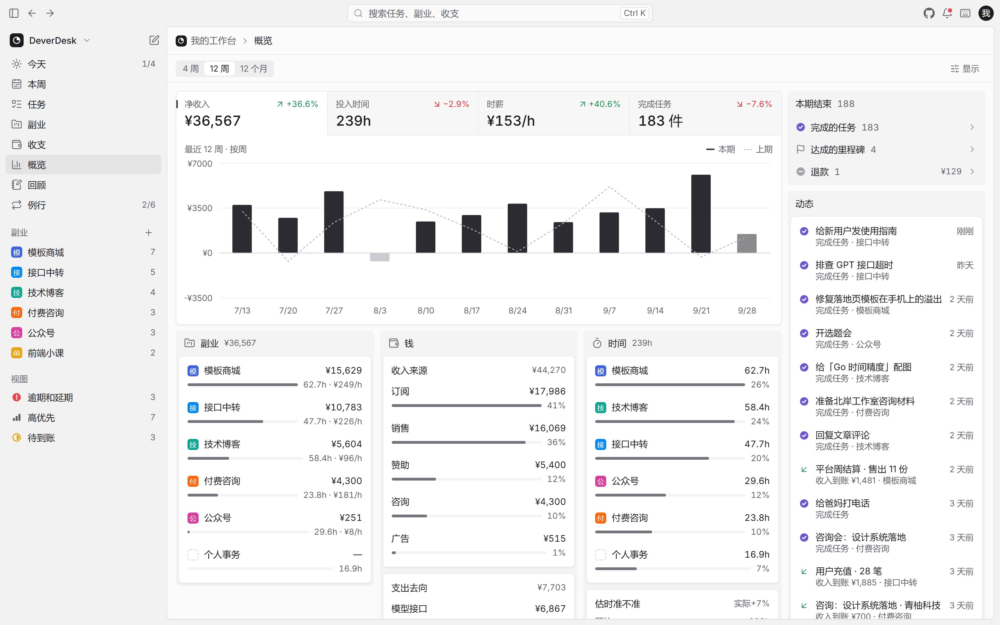
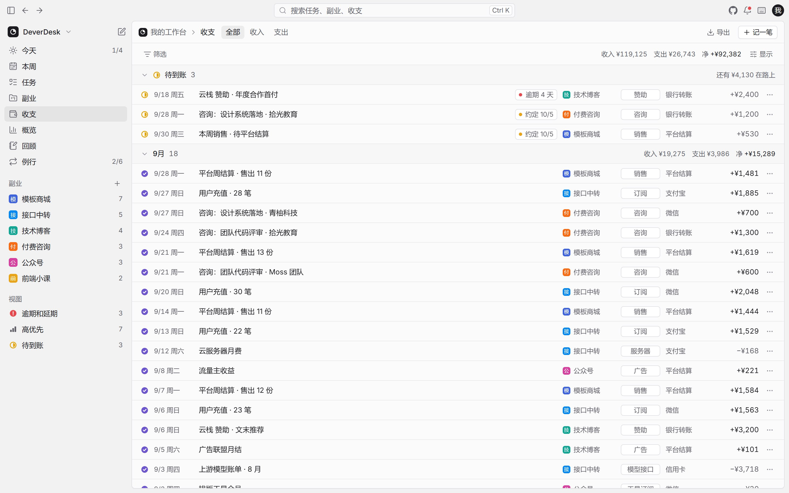

<div align="center">


# DeverDesk

**独立开发者的一人公司控制台。**

任务、时间和副业收支放在一起，算出每个副业每小时到底赚多少。

[](https://github.com/evepupil/DeverDesk/actions/workflows/ci.yml)
[](LICENSE)
[](https://deverdesk.com)
[](#部署在线版)

[English](README.md) · **简体中文**

</div>



## 为什么做 DeverDesk

独立开发者手上往往同时跑着好几件事：模板商店、接口中转、技术博客、接点咨询。任务工具不管钱，记账工具不管时间，到头来很难说清哪个副业值得继续投入晚上的时间。

DeverDesk 把任务、时间和收支放在一起，并且连起来：每个任务、每段投入的时间、每笔收支都归到某个副业下，所以能直接算出每个副业的净收入、投入时长和**时薪**。

- **开源、自己部署。** 跑在你自己的 Cloudflare 账号里，收支数据不经过任何别人的服务器。
- **不花钱。** Cloudflare 的免费额度个人用绰绰有余。
- **用起来快。** 键盘优先，有命令面板和一行快速添加，断网也照常能用。

## 功能

| 页面 | 做什么 |
| --- | --- |
| **今天** | 今天的计划；之前没做完的一键挪到今天；把任务拖进时间线、拖下边改时长，或者一键自动排；例行打卡、本月净收入对照目标、今天的投入记录 |
| **本周** | 七天从上往下排，每天一个容量条，一眼看出哪天排满；任务在日子之间拖动；右边是还没排日子的任务 |
| **任务** | 看板或列表；按状态、副业、优先级分组；筛选、排序；卡片拖到别的列就改成那一列的状态 |
| **副业** | 按构思、搭建中、运营中排成看板；每个副业的本月净收入、投入、时薪、月目标进度、下个里程碑；12 周走势 |
| **收支** | 待到账单独放最上面，其余按月、副业或分类分组；标记到账、退款；导出表格 |
| **概览** | 净收入、投入时间、时薪、完成任务四个指标切换同一张走势图；按副业、钱、时间拆开看 |
| **回顾** | 每周自动写一段小结，完成了什么、时间花在哪，再配三段复盘笔记 |
| **例行** | 每天、每周、每月的例行事务，连续期数和打卡格子 |

全局还有：命令面板（<kbd>Ctrl</kbd>/<kbd>⌘</kbd> <kbd>K</kbd>）；右上角提醒（排超了、逾期、钱过了约定日还没到）；计时条；一行快速添加（`写周报 30m #技术博客 明天 !!`）；手机上的快速记录按钮；导出和导入备份；键盘快捷键（<kbd>?</kbd>）。

界面有**中文和英文**两种语言，第一次打开按浏览器语言选，也可以在头像菜单里随时切换；金额按你在个人设置里选的币种显示。

<table>
  <tr>
    <td width="33%"></td>
    <td width="33%"></td>
    <td width="33%"></td>
  </tr>
  <tr>
    <td align="center">任务</td>
    <td align="center">概览</td>
    <td align="center">收支</td>
  </tr>
</table>

## 两个版本

|  | 本地版 | 在线版 |
| --- | --- | --- |
| 数据存在哪 | 只在这个浏览器里 | 你自己 Cloudflare 账号里的 D1 数据库 |
| 多设备同步 | 不同步 | 按条自动同步，断网也能用 |
| 登录 | 不用登录 | 访问口令，或者 Cloudflare Access |
| 怎么用 | 打开 [deverdesk.com](https://deverdesk.com) | [部署在线版](#部署在线版) |

两个版本是同一套代码，打包时选一个。从本地版换到在线版，只要导出一份备份再导入。

## 在线试用

打开 **[deverdesk.com](https://deverdesk.com)**，这是带样例数据的本地版：什么都不会传到服务器，你的改动只留在自己的浏览器里。

## 部署在线版

在线版由三部分组成：Next.js 导出的静态页面、Cloudflare Worker（Cloudflare 上运行的服务端程序，负责接口）和 D1 数据库（Cloudflare 的 SQLite 数据库）。三者作为一个 Worker 一起部署。

### 一键部署

[](https://deploy.workers.cloudflare.com/?url=https://github.com/evepupil/DeverDesk)

1. 授权 GitHub 后，Cloudflare 会在你的账号下复制一份本仓库，以后你往这个副本推送代码，它会自动重新部署。
2. 自动建好 D1 数据库。
3. 填写 `DEVERDESK_PASSWORD`：以后打开网站时要输入的访问口令。
4. 部署完成后打开给你的 `*.workers.dev` 地址，输入口令就能用。

想换成自己的域名：在 Cloudflare 后台给这个 Worker 加自定义域名（**Workers & Pages → 你的 Worker → Settings → Domains & Routes**）。

### 命令行部署

需要 Node.js 22 以上和 pnpm 10。

```bash
git clone https://github.com/evepupil/DeverDesk.git
cd DeverDesk
pnpm install
pnpm exec wrangler login                          # 登录你的 Cloudflare 账号
pnpm build
pnpm run deploy                                   # 先建表，再部署 Worker
pnpm exec wrangler secret put DEVERDESK_PASSWORD  # 设置访问口令（输入时不显示）
```

`pnpm run deploy` 会先把数据库迁移（建表和改表结构的脚本）应用到线上，再部署。新账号第一次部署时还没有数据库，它会先部署一次让 Wrangler 自动建库，再建表。注意要写 `run`：单写 `pnpm deploy` 是 pnpm 自带的另一个命令。

以后更新：拉取最新代码，再跑一遍 `pnpm build && pnpm run deploy`。

### 登录方式

- **访问口令**（默认），用 `DEVERDESK_PASSWORD` 设置。登录一次管 30 天；同一个 IP 输错 10 次，15 分钟内不能再试；改口令会让所有设备都退出登录。
- **Cloudflare Access**（Cloudflare 的统一登录网关）：把 Worker 放到 [Cloudflare Access](https://developers.cloudflare.com/cloudflare-one/policies/access/) 后面，再设置 `ACCESS_TEAM_DOMAIN`（比如 `your-team.cloudflareaccess.com`）和 `ACCESS_AUD`（应用的 Audience 标签）。通过 Access 登录的人不用再输口令。

### 从本地版搬数据

在本地版的头像菜单里选 **导出备份**，再到在线版的头像菜单里选 **导入备份**，选中那个文件即可。

## 自动化接口

在线版提供了几个 HTTP 接口，给脚本和 AI 助手用，也是以后 MCP 服务（让 AI 助手直接读写数据的协议）的基础。在头像菜单 → **访问令牌** 里新建个人令牌；令牌只显示一次，服务器上只存它的摘要。

| 接口 | 做什么 |
| --- | --- |
| `POST /api/tasks` | 新建任务。字段：`title`（必填）、`plannedFor`（`YYYY-MM-DD`）、`estimateMin`、`priority`（0–4）、`projectId`、`notes` |
| `POST /api/ledger` | 记一笔收入或支出。字段：`kind`（`income` / `expense`）和 `amount` 必填，另有 `category`、`channel`、`projectId`、`status`、`date`、`expectedOn`、`note` |
| `GET /api/summary?month=YYYY-MM` | 某个月的收入、支出、净收入、投入分钟数和完成任务数 |

```bash
curl -X POST https://your-workspace.example.com/api/tasks \
  -H "Authorization: Bearer dd_你的令牌" \
  -H "Content-Type: application/json" \
  -d '{"title":"写上线公告","plannedFor":"2026-10-01","estimateMin":45}'
```

通过接口写入的记录和手动改动一样，会同步到你所有的设备。

## 本地开发

需要 Node.js 22 以上和 pnpm 10，Windows、macOS、Linux 都能开发。

```bash
pnpm install
pnpm dev          # 在线版：页面 :3000，接口 :8787，本地访问口令 dev
pnpm dev:local    # 只跑本地版页面，不需要接口和数据库
```

第一次 `pnpm dev` 会从 `.dev.vars.example` 复制出 `.dev.vars`（口令设为 `dev`），并在本地数据库里建好表。端口用环境变量 `PORT` 和 `API_PORT` 改。

| 命令 | 做什么 |
| --- | --- |
| `pnpm build` / `pnpm build:local` | 把在线版 / 本地版打包到 `out/` |
| `pnpm typecheck` | 页面和 Worker 的类型检查 |
| `pnpm lint` | 代码检查（ESLint） |
| `pnpm test` | 单元测试（Vitest） |
| `pnpm probe` | 用 Microsoft Edge 在打包好的本地版上把核心操作真点一遍，中英文都查（先跑 `pnpm build:local`） |
| `pnpm e2e` | 在本机起接口，模拟两台设备登录和互相同步（先跑 `pnpm build`；口令从 `.dev.vars` 读） |
| `pnpm shots` / `pnpm shots:readme` | 截图：肉眼核对用 / 本 README 用 |

打包时可设的环境变量：

| 变量 | 作用 |
| --- | --- |
| `NEXT_PUBLIC_DEVERDESK_EDITION` | `local` 打包本地版，其余打包在线版 |
| `NEXT_PUBLIC_DEVERDESK_REPO_URL` | 本地版里 GitHub 图标指向的仓库（fork 后可以换成你自己的） |
| `NEXT_PUBLIC_DEVERDESK_ANALYTICS_TOKEN` | Cloudflare 网页统计的令牌，只在本地版生效 |

## 技术栈

- **页面：** Next.js 16（静态导出）、React 19、TypeScript 严格模式、Tailwind CSS 4、shadcn/ui（基于 Radix）、Zustand、Recharts
- **后端：** Cloudflare Workers（含静态资源托管）、D1（SQLite）、Web Crypto
- **质量：** Vitest、ESLint，以及基于 Playwright 的核对脚本

## 目录结构

```text
src/
  app/          路由
  features/     外框和各个页面，一个页面一个目录
  components/   基础组件（shadcn/ui）和小部件
  domain/       只做计算的逻辑：排期、例行、收支、指标、快速添加解析、搜索、备份
  state/        数据仓库、界面偏好、同步状态，以及存储层（浏览器或云端）
  i18n/         语言设置和中英文词条
  data/         状态叫法、分类选项和样例数据生成
  sync/         浏览器和 Worker 共用的同步约定
worker/         Cloudflare Worker：登录、同步、访问令牌、自动化接口、D1 建表脚本
scripts/        开发、打包、部署和核对脚本
deploy/demo/    deverdesk.com 演示站的部署配置
docs/           设计文档
```

## 路线图

- [x] 同一套代码出本地版和在线版
- [x] 在线版后端：登录、按条同步、断网可用、一键部署
- [x] 中英文界面、记账币种
- [ ] 从收款平台自动导入收入
- [ ] MCP 服务，让 AI 助手能读取和记录数据

里程碑和各模块的设计见 [docs/roadmap.md](docs/roadmap.md)。

## 参与贡献

欢迎提 Issue 和 Pull Request，做法见 [CONTRIBUTING.md](CONTRIBUTING.md)。界面上的文字都在 `src/i18n/messages` 里，新增文字时请中英文一起加。

## 安全

发现安全问题请私下报告，见 [SECURITY.md](SECURITY.md)。

## 许可证

[GNU AGPL v3.0](LICENSE)。可以自由使用、修改和自己部署；如果把改过的版本作为在线服务提供给别人，也需要向他们公开源代码。
